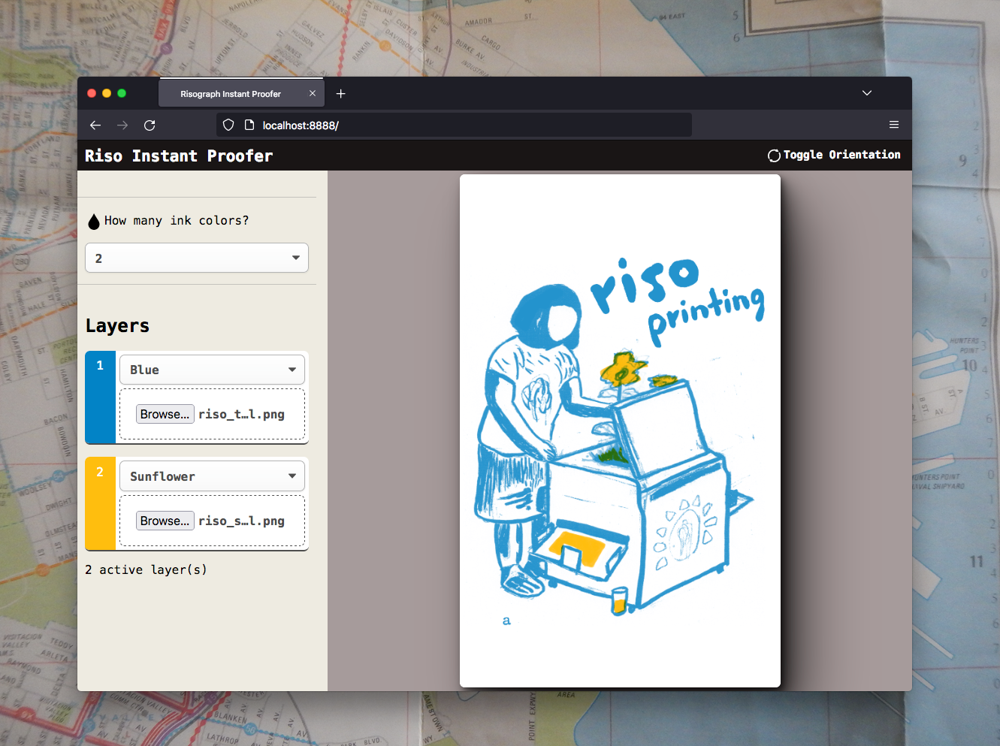

# Riso Instant Proofer

This web tool is intended for those who need to quickly preview grayscale artwork for multi-color printing. You upload a grayscale image (JPG or PNG) for each layer and set the ink color. It will quickly render a rough preview of the result in the browser (using `<canvas>` and JavaScript)

If you run a print studio, it is easy to customize with your particular lineup of Riso ink colors, following instructions below! Your end users do not have to download any software.

## License

* 100% FREE for **non-commercial** use & modification, including by not-for-profit print shops.
* Any use for commercial projects (including for-profit print shops) requires written permission from me.

## How to use (for less technical users)

This "application" is a small collection of JavaScript, HTML, and CSS files.

To host this to the public, you need a regular web host — where you can upload custom code and files right onto the server.

This is easy with a traditional web hosting account from GoDaddy, etc, but might be difficult if you are using a special service like Squarespace or Wordpress.com. If you are not sure how to upload these files, please ask your website hosting company.

You can also run this on your local computer, by downloading a software like [MAMP](https://www.mamp.info/en/downloads/) (Mac). Download these files and place them in the MAMP folder on your computer. Start the MAMP server and go to this directory in your web browser. This might be useful for your studio computers.

## Customization
### Change Riso ink colors
Open file `js/main.js`. At the top you will see a JavaScript object titled `inkColorsObj`. You will see a series of keyed values - each looks like this:
`'#0078bf': 'Blue'`

Replace the first value of each with your [ink color's hex value](https://stencil.wiki/colors) equivalent, and the second value with it's plain text name. *Do not use any spaces!!* Repeat for all your inks.

### Change interface colors
Open file `css/style.css`. Towards the top you will see a series of variables defining key colors of the interface. Change these values to whatever you want.

### Edit messages shown in explainer section
Open file `index.html`. You will see this text in the HTML and can edit it.

### Misc.
To allow preview of more or less than 4 layers, edit file `index.html`. Find the line `<template x-for="qty in 4">` and change 4 to your desired number of inks which can be previewed at one time. (Note, you also need to change `initializeCanvases()` function in `main.js` to create extra canvases)

To change the default orientation of the canvas, set variable `orientationLandscape` to `false` (in file `js/main.js`).

## Support and future improvements

I can't offer support for using or installing this software. Please try to find somebody who is familiar with web hosting, etc. 

If you find a bug or glitch, you can report it in the issues tab here. If you have the ability to make improvements and contributions to this, please do!

Future possibilities for improvement include:

* Set paper color
* Set paper size dimensions
* ~~Higher-resolution preview~~ done!
* Edit all ink colors/settings from one config.js file

Known problems:

* Certain images don't display in Safari or iOS Safari. No error will be thrown.

But no guarantees! :)
